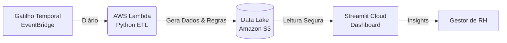

# ✈️ HCI-F: Human Capital Intelligence Framework

**Uma solução de Engenharia de Dados Serverless para monitoramento preditivo de Turnover e Absenteísmo.**

---

## 📋 O Problema de Negócio
O setor de Recursos Humanos enfrenta dificuldades para identificar proativamente colaboradores com alto risco de saída (Churn) ou absenteísmo crônico. A análise manual de planilhas é lenta e reativa.

**O Objetivo:** Criar um pipeline de dados automatizado que:
1. Gera/Ingere dados de colaboradores.
2. Aplica regras de negócio para classificar riscos.
3. Disponibiliza KPIs em tempo real para tomada de decisão.

---

## 🏗️ Arquitetura da Solução

O projeto utiliza uma arquitetura **100% Serverless** na AWS para garantir escalabilidade e baixo custo.

Componentes Técnicos
Backend (ETL): AWS Lambda executando Python 3.11 com Layer Pandas/NumPy.

Armazenamento (Data Lake): Amazon S3 (Bucket com versionamento e bloqueio público).

Frontend (Analytics): Streamlit consumindo dados via boto3 com gerenciamento de segredos.

Orquestração: Amazon EventBridge (CloudWatch Events) para execução agendada.