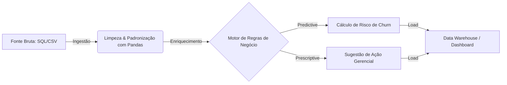

# Human Capital Intelligence Framework (HCI-F) ✈️📊


> **Uma solução de Análise de Dados para transformar relatórios um ecossistema de decisão automatizada, focado na redução de turnover e otimização de treinamentos.**

---

## 🎯 Objetivo do Projeto
Este projeto visa modernizar o pipeline de dados de capital humano em empresas de grande porte, exemplo: (Setores de Logística/Aviação e Bancário). 

O framework substitui processos manuais baseados em planilhas desconexas por uma arquitetura de dados robusta que integra:
1.  **Ingestão de Dados:** Consolidação de múltiplas fontes (ERP, Excel, CSV).
2.  **Análise Preditiva:** Identificação de padrões de risco de saída (Early Churn).
3.  **Análise Prescritiva:** Um motor lógico que sugere ações gerenciais baseadas no momento da jornada do colaborador.

## 🏗️ Arquitetura da Solução

O fluxo de dados segue o padrão ETL (Extract, Transform, Load) enriquecido com regras de negócio complexas.


## ⚙️Funcionalidade Principais

1. Geração de dados aleatórios
   Devido a restrições de confidencialidade (LGPD/COMPLIANCE), desenvolvi um módulo que utiliza a biblioteca Faker para gerar dados sintéticos simulando dados reais de produção. Isso permite testar a escalabilidade do sistema com milhares de registros sem expor dados sensiveis.

2. Motor de decisão prescritiva (Engine)
  O diferencial deste projeto não é apenas apontar *quem* faltou, mas identificar os motivos e sugerir uma tomada de *decisão*. O algoritmo aplica pesos diferentes baseados no tempo de casa:

| PERFIL | CENÁRIO | TOMADA DE DECISÃO | 
| :---: | :---: | :---: |
| INICIANTE | FALTA POR MOTIVO PESSOAL | 🤝 FEEDBACK (ENTENDER A CAUSA) |
| INICIANTE | FALTA INJUSTIFICADA | ⚠️ FEEDBACK CORRETIVO DE POSTURA |
| VETERANO (MIGRAÇÃO) | FALTA INJUSTIFICADA | 🚨 MEDIDA DISCIPLINAR / COMPLIANCE |
| OUTROS PERFIS | SAÚDE MENTAL/BURNOUT | 🩺 ENCAMINHAMENTO SOCIAL / SESMT

3. Deteccão de padrões temporais
  Utilização de lógica de séries temporais para identificar "efeito cascata" em absenteísmo. O sistema detecta se uma falta na **Semana N** aumenta a probabilidade de reincidência na **Semana N+1**.

## 🛠️ Stack tecnológico
* **Linguagem:** Python 3.x
* **Manipulação de dados:** Pandas, NumPy
* **Banco de dados:** SQLAlchemy (Interface agnóstica para SQL Server/SQLite)
* **Dados sintéticos:** Faker
* **Machine learning:** Scikit-Learn

## 🚀 Como executar

**Pré-requisitos**
```bash
# pip install pandas sqlalchemy faker scikit-learn
```
**Executando o pipeline**
1. Clone o repositório
2. Execute o script principal para gerar a base e processar as regras:

```Bash
# python src/main_pipeline.py
```
3. O sistema gerará dois artefatos na pasta /output:
- `DB_RH_CONSOLIDADO.db`: Banco de dados SQL com histórico
- `RELATORIO_PRESCRITIVO_ACAO.csv`: Lista final para os gestores.


## 📈 Próximos passos (Roadmap)
- [ ] Integração com API de nuvem (AWS Lambda / Google Cloud Functions)
- [ ] Dashboard em Real-Time utilizando Streamlit ou Next.js
- [ ] Implementação de notificações automáticas por e-mail para os gestores via SMTP.

## 

Desenvolvido por Vinicios Análise de Dados & Business Intelligence [LinkedIn/Portfólio]


